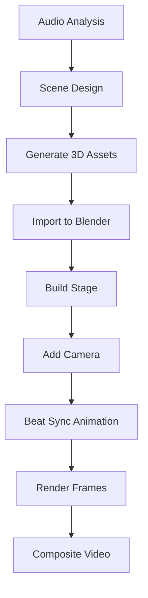

---
tags:
  - blender
  - 3d-rendering
  - mcp
  - scene-building
aliases:
  - Blender MCP
  - Blender Integration
  - Scene Builder
cssclasses:
  - technical-guide
date: 2026-08-24
---

# 🖥️ Blender MCP Integration

> [!info] Scope
> Controlling Blender 5.2 via MCP protocol for automated scene building.
> Part of [[Native Media AI Studio]] music video pipeline.

---

## Setup Requirements

### Blender Configuration

> [!warning] Enable Addon
> 1. Open Blender 5.2
> 2. Edit → Preferences → Add-ons
> 3. Search "Blender MCP"
> 4. Enable the checkbox
> 5. Sidebar (N-panel) → "Blender MCP" tab → Start Server

### Connection Details

| Setting | Value |
|---------|-------|
| Blender Version | 5.2.0 LTS |
| Addon Version | 1.5 |
| Protocol Version | 4 |
| Transport | WebSocket |
| MCP Server | `blender-mcp` |

---

## Available Capabilities

### Scene Operations

> [!example] Get Scene Info
> ```python
> blender_get_scene_info()
> # Returns: object count, object list, materials
> ```

> [!example] Execute Python Code
> ```python
> blender_execute_blender_code(code="""
> import bpy
> bpy.ops.mesh.primitive_cube_add(size=2, location=(0, 0, 0))
> """)
> ```

### Object Operations

> [!example] Get Object Details
> ```python
> blender_get_object_info(object_name="Cube")
> # Returns: location, rotation, scale, dimensions
> ```

> [!example] Viewport Screenshot
> ```python
> blender_get_viewport_screenshot()
> # Returns: image of current viewport
> ```

### PolyHaven Assets

> [!tip] Free HDRIs & Textures
> ```python
> blender_download_polyhaven_asset(
>     asset_id="symmetrical_garden",
>     asset_type="hdris",
>     resolution="2k"
> )
> ```

### Sketchfab Models (1M+ free CC library, replaces banger.show cloud import)

> [!info] Setup — free, no paid plan
> 1. Free account at `sketchfab.com` (Epic Games login works) → `Settings → Password → API Token`
> 2. Persistent key (priority `Prefs → Scene → env` `tools/blender_mcp_addon.py:338`):
>    * **Env (recommended):** `setx BLENDERMCP_SKETCHFAB_API_KEY "<token>"` + repo `.env:1` `BLENDERMCP_SKETCHFAB_API_KEY=...` (`.gitignore:76` ignores `.env`)
>    * **Blender UI:** `N-panel → BlenderMCP → Use assets from Sketchfab` + paste in `Addon Preferences → sketchfab_api_key` `tools/blender_mcp_addon.py:3184` and `Scene.blendermcp_sketchfab_api_key` `tools/blender_mcp_addon.py:3508`, then `bpy.ops.wm.save_userpref()`
> 3. Verify: `blender_get_sketchfab_status()` → `Logged in as: <user>` (`Data API v3` `/v3/me` `tools/blender_mcp_addon.py:2302`). Free `basic` account suffices; `Pro` only adds private models/500MB uploads/viewer white-label.
> 4. Search is public (no key); **Download API** `/v3/models/{uid}/download` `tools/blender_mcp_addon.py:2518` requires that free token (`Authorization: Token <key>` → `glTF/GLB/USDZ`, not source `FBX/OBJ`).

> [!note] 3D Model Download (offline after download — no 10/day limit vs banger.show)
> ```python
> # Search (public, no key) then download with free token
> blender_search_sketchfab_models(query="boombox", count=20, downloadable=True)
> blender_get_sketchfab_model_preview(uid="abc123")
> blender_download_sketchfab_model(
>     uid="abc123",
>     target_size=1.0,      # meters, largest dimension
>     normalize_size=True
> )
> # Curated music-video picks: stage d5c7733d06d24947bf60b3a0fe203f69, boombox fb8a583f743a47268a2aaa420624c794,
> # speakers 725273fbdde54a1babaf6ce1c95b96b4, turntable b7bb537521bd4fa9be15926c24bb4656 (all CC BY, low-poly for GTX 1070 Ti 8GB)
> ```

### Blend -> GLB for Media Library + Three.js Studio (AI agent pipeline)

> [!success] `stage.blend` (`21 MB`, now `output/generated_3d/stage.glb` + `public/models/blends/stage.glb`) — use headless converter so Blender UI can stay hung
> ```powershell
> # AI agents after blender_execute_blender_code generation:
> python tools/convert_blend_to_glb.py stage.blend --public
> #  -> Blender --background --python (Y-up, apply, bake animations) -> output/generated_3d/<name>.glb (Media Library file_type=3d outputs.py:202)
> #  -> packages/frontend/public/models/blends/<name>.glb (/models/blends/<name>.glb for Three.js GLTFLoader)
> # Handles *.blend at repo root (gitignored *.blend:122) — output GLB is ignored, public GLB is tracked (!public:133)
> ```

> [!tip] Three.js Studio import + animation
> * Any `AnimObject` with `modelUrl` now loads via `GLTFLoader` (`hooks/useMeshFactory.ts:66` `else if (obj.modelUrl)` — not just `type==="character"`), so `boombox/character/stage` all animate
> * `InspectorTab.tsx:43` shows Animation controls (clip dropdown, scrubber `currentTime/duration`, `Play/Pause`, `Speed`, `Loop`) for **any** `modelUrl` (was character-only)
> * Timeline + beat sync: `sceneConfig.beatPunch` (`ThreeJSStudio.tsx:TrackInfoBar`) + per-object `bobSpeed/bobAmount/rotateSpeed` + `AnimationMixer` `useMeshFactory.ts:84` + keyframe bake `export_animations True` in `convert_blend_to_glb.py`
> * `MediaLibrary.tsx:229` `handleAddToStudio()` -> `pendingCharacter` `modelUrl: /output/generated_3d/*.glb` dispatches to Studio; drag-drop `.glb` also works `InspectorTab.tsx:39`

---

## Scene Building for Music Videos

### Stage Construction

> [!example] Concert Stage
> ```python
> blender_execute_blender_code(code="""
> import bpy
> 
> # Clear scene
> bpy.ops.object.select_all(action='SELECT')
> bpy.ops.object.delete()
> 
> # Create stage platform
> bpy.ops.mesh.primitive_cylinder_add(
>     radius=5, depth=0.3, location=(0, 0, -0.15)
> )
> stage = bpy.context.active_object
> stage.name = "Stage"
> 
> # Add LED wall (back)
> bpy.ops.mesh.primitive_plane_add(
>     size=8, location=(0, -3, 2)
> )
> led_wall = bpy.context.active_object
> led_wall.name = "LED_Wall"
> led_wall.rotation_euler = (1.1, 0, 0)
> 
> # Add lighting
> bpy.ops.object.light_add(type='SPOT', location=(2, 3, 4))
> spot = bpy.context.active_object
> spot.data.energy = 500
> spot.data.spot_size = 0.8
> spot.data.color = (0.9, 0.7, 1.0)  # Purple tint
> """)
> ```

### Character Placement

> [!tip] Import 3D Character
> Import generated 3D models from [[3d-rendering]]:
> ```python
> blender_execute_blender_code(code="""
> import bpy
> 
> # Import generated 3D model
> bpy.ops.import_scene.obj(filepath="output/generated_3d/my_robot.obj")
> character = bpy.context.selected_objects[0]
> character.name = "MainCharacter"
> character.location = (0, 0, 0)
> character.scale = (0.5, 0.5, 0.5)
> """)
> ```

### Camera Setup

> [!example] Cinematic Camera
> ```python
> blender_execute_blender_code(code="""
> import bpy
> 
> # Create camera
> bpy.ops.object.camera_add(location=(7, -7, 4))
> camera = bpy.context.active_object
> camera.name = "MainCamera"
> 
> # Point at stage center
> direction = (0, 0, 1)
> camera.rotation_euler = (1.1, 0, 0.78)
> 
> # Set as active camera
> bpy.context.scene.camera = camera
> 
> # Camera settings
> cam_data = camera.data
> cam_data.lens = 35  # 35mm focal length
> cam_data.sensor_width = 36
> cam_data.dof.use_dof = True
> cam_data.dof.aperture_fstop = 2.8
> """)
> ```

---

## Beat-Synced Animation

> [!important] Music Sync
> Animate objects to beat timestamps from audio analysis:

```python
# Beat times from [[music-video-production]]
beat_times = [0.0, 0.5, 1.0, 1.5, 2.0, 2.5, 3.0]

# Animate camera on beats
for i, beat_time in enumerate(beat_times):
    frame = int(beat_time * 24)  # 24 fps
    
    # Camera shake on beat
    camera.location.x = 7 + (0.1 if i % 2 == 0 else -0.1)
    camera.keyframe_insert(data_path="location", frame=frame)
```

### Animation Presets

| Effect | Description | Use Case |
|--------|-------------|----------|
| Beat Pulse | Scale object on each beat | Props, stage elements |
| Camera Shake | Small position offset on beats | Energy moments |
| Color Flash | Light color change on beats | LED walls, lights |
| Zoom In | Dolly in on chorus | Build intensity |
| Orbit | Circle camera around subject | Showcase moments |

---

## Rendering for Music Videos

### Output Settings

> [!example] Video Render Settings
> ```python
> blender_execute_blender_code(code="""
> import bpy
> scene = bpy.context.scene
> 
> # Output settings
> scene.render.filepath = "output/frames/frame_"
> scene.render.image_settings.file_format = 'PNG'
> scene.render.resolution_x = 1920
> scene.render.resolution_y = 1080
> scene.render.resolution_percentage = 100
> 
> # Frame range (10 seconds at 24fps)
> scene.frame_start = 1
> scene.frame_end = 240
> scene.render.fps = 24
> 
> # Render engine (CUDA)
> scene.render.engine = 'CYCLES'
> scene.cycles.device = 'GPU'
> scene.cycles.samples = 128
> scene.cycles.use_denoising = True
> """)
> ```

### Render Animation

> [!note] Batch Rendering
> ```python
> blender_execute_blender_code(code="""
> import bpy
> bpy.ops.render.render(animation=True)
> """)
> ```

---

## Integration with Pipeline

### Workflow Order



### Data Flow

1. **[[music-video-production]]** → Audio analysis (beats, sections)
2. **[[3d-rendering]]** → Generate 3D props/characters
3. **[[comfyui-workflows]]** → Generate textures/backgrounds
4. **Blender MCP** → Build scene, animate, render
5. **[[youtube-optimization]]** → Export and publish

---

## Troubleshooting

### Connection Issues

| Error | Cause | Solution |
|-------|-------|----------|
| `Could not connect` | Addon not enabled | Enable in Preferences → Add-ons |
| `Server not running` | MCP stopped | Click "Start MCP Server" in sidebar |
| `Protocol version mismatch` | Outdated addon | Run `uvx blender-mcp install-addon` |

### Rendering Issues

| Error | Cause | Solution |
|-------|-------|----------|
| Black render | No lights/lights too weak | Add lighting to scene |
| Slow render | High samples/resolution | Reduce samples, use EEVEE |
| OOM on render | Scene too complex | Reduce geometry, use instancing |

---

## See Also

- [[music-video-production]] — Full production workflow
- [[3d-rendering]] — GPU rendering optimization
- [[comfyui-workflows]] — Asset generation
- [[technical-reference]] — System architecture
- [[prompt-engineering]] — 3D asset prompts

---

*Last updated: 2026-08-24*
