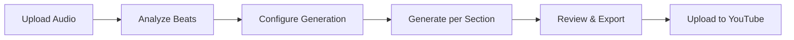

---
tags:
  - index
  - knowledge-library
  - music-video
  - production
aliases:
  - Knowledge Library Index
  - Music Video Knowledge Base
  - Production Reference
cssclasses:
  - knowledge-index
date: 2026-09-29
---

# 📚 Knowledge Library Index

> [!info] Purpose
> Centralized knowledge hub for AI agents and creators to produce compelling music videos for YouTube.
> Built for [[Native Media AI Studio]] — a full-stack AI music video creation suite.

> [!tip] For AI Agents
> This vault is machine-readable. All documents use plain markdown with YAML frontmatter.
> Link between documents using `[[wiki-links]]` for cross-referencing.

---

## 🗂️ Library Structure

### 🎬 Production Pipeline (Workflow & Creative)

- [[music-video-production|🎵 Music Video Production Guide]] — Complete production workflow from audio upload to final export
- [[youtube-optimization|📺 YouTube Optimization]] — Platform-specific optimization for reach and engagement
- [[audio-reactive-production|🎧 Audio-Reactive Production]] — Audio → visual mapping, beat sync
- [[prompt-engineering|✍️ Prompt Engineering]] — Effective prompts + repair/versioning workflow
- [[character-animation-2026-summer-synthesis|🎭 Character Animation 2026 — Summer Synthesis]] — Story-first puppet, beatPhase sync, performance-driven
- [[silhouette-character-animation|🎭 Silhouette Character Animation]] — Character rigging & motion
- [[character-driven-visualization-research|🔬 Character-Driven Visualization]] — Character research
- [[lyric-beat-visualization-2026|🎵 Lyric + Beat Visualization 2026]] — Code-driven, deterministic beat-synced lyric videos for HyperFrames/HTML compositions
- [[music-video-vision-prompts|👁️ Music Video Vision Prompts]] — Structured vision-model prompts for section-aware, sync-checked still analysis and QA

### 🛠️ Technical Implementation (Code & Systems)

- [[technical-reference|⚙️ Technical Reference]] — System architecture, API reference, service management
- [[comfyui-workflows|🎨 ComfyUI Workflows]] — Custom workflows for image/video generation
- [[frontend-build-pipeline|🔧 Frontend Build Pipeline]] — Vite + React + TS build: incremental tsc, Vite 8 audit notes, strictPort, HMR overlays
- [[backend-debugging-guide|🐛 Backend Debugging Guide]] — Debugging patterns for FastAPI/queue/VRAM
- [[notification-system-improvements-2026|🔔 Notification System Improvements 2026]] — Priority-based SSE routing, toast collapse, cross-tab sync, replay, notification center
- [[python-environment-management|🐍 Python Environment Management]] — venv mechanics, decoupling graph, PyTorch×Pascal (sm_61) wheel matrix, env migration recipes
- [[remotion-guide|🎬 Remotion Video Compositing]] — Programmatic video with React
- [[e2e-test-plan-2026|🧪 E2E Test Plan 2026]] — Full-pipeline Play smoke + backend integration + real-service E2E plan
- [[modern-css-2026|🎨 Modern CSS 2026]] — Tailwind v4 @theme/layers, OKLCH theming, gradient spaces, a11y media queries, verification checklist
- [[javascript-upgrade-research-2026|🔧 JavaScript Upgrade Research 2026]] — TypeScript 7 adoption, deprecated mp4-muxer replacement, React 19 features, Vite 8/Rolldown optimization, Tailwind v4 container queries, CI gaps, Prettier adoption

### 🎮 MCP & Platform Integrations

- [[mcp-contracts-2026|🤝 MCP Tool Contracts 2026]] — Canonical Unity/Ollama/Vision/HyperFrames tool schemas
- [[unity-integration-2026|🎮 Unity MCP Integration]] — Canonical Unity workflow, render-path, hardware-fit, and operations guide
- [[blender-mcp|🧊 Blender MCP]] — Blender MCP integration for 3D scene construction
- [[integration-ollama|🤖 Ollama Integration]] — Local LLM inference, tool calling, agent loop patterns
- [[hunyuan3d-setup|🧊 Hunyuan3D-2mini Setup]] — ComfyUI 3D generation with Kijai wrapper
- [[three-js-studio|🌐 Three.js Studio]] — Browser-based 3D scene builder with particles & reflections
- [[go-integration-2026|🔀 Go Integration 2026]] — Split-stack architecture: Go for dashboard/SSE, media workers, gateway; Python for AI/model layer
- [[go-benefits-deep-dive-2026|🔀 Go Benefits Deep Dive 2026]] — Measured memory/startup/concurrency wins, code patterns, deployment model, failure-mode comparison, future expansion candidates
- [[kilo-code-subagent-orchestration|🤖 Kilo Code Subagent Orchestration]] — Subagent architecture, provider errors, optimization strategies
- [[kilo-code-subagent-optimization|🚀 Kilo Code Subagent Optimization]] — Config implementations, concurrency limits, retry jitter, verification
- [[ai-agent-navigation|🤖 AI Agent Navigation]] — Quick lookup table for agents

### 🎨 Creative & Visual (Design & Effects)

- [[visualization-effects|✨ Visualization Effects]] — WebGPU/TSL, particles, shaders, post-processing, volumetrics
- [[3d-visualization-best-practices-2026|🎛️ 3D Visualization Best Practices 2026]] — Full audit of all 13 viz styles + 7 studio templates, R3F/WebGPU/perf/a11y rules
- [[2d-visualization-2026|🎨 2D Visualization 2026]] — Canvas2D/PixiJS/p5.js/Waviz 2026 open source 2D stacks
- [[webgl-webgpu-audio-viz-2026|🎵 WebGL/WebGPU Audio Viz 2026]] — Rust/WASM audio analysis, GPU compute shaders, music-reactive 3D, multi-threaded visualization
- [[hyperframes-audio-reactive-2026|🎬 HyperFrames Audio-Reactive Visualizations 2026]] — Pre-extracted audio data, per-frame GSAP sampling, Three.js/WebGPU scenes, lyric/beat/section sync, genre-aware presets, integration with studio backend
- [[3d-rendering|🧊 3D Rendering]] — GPU rendering, Blender 5.2 EEVEE Next, optimization
- [[3d-object-design-2026|🧊 3D Object Design 2026]] — Procedural abstract 3D objects for visualizers: chrome blobs, materials, beat-synced morphing
- [[advanced-visualization-techniques-2026|✨ Advanced Visualization Techniques 2026]] — WebGL shaders, WebGPU performance, kinetic typography, real-time audio analysis
- [[canvas2d-bar-visualization-research|📊 Canvas2D Bar Visualization Research]] — Modern bar-mode improvements: smoothing, glow, reflections, HiDPI rendering
- [[color-strategy-2026|🎨 Color Strategy 2026]] — APCA vs WCAG dark-mode contrast, measured token audit, tier rules
- [[design-auditing-2026|🔍 Design Auditing 2026]] — Contrast+axe+VLM audit layers, runbook for `contrast_audit.py`
- [[dark-ui-color-system-2026|🌙 Dark UI Color System 2026]] — OKLCH dark-mode tokens, contrast, accessibility
- [[design-philosophy-2026|💭 Design Philosophy 2026]] — UX principles and design-system philosophy
- [[shader-color-science-2026|🎨 Shader Color Science 2026]] — GLSL color science: OKLCH, tonemapping, dithering for audio-reactive shaders
- [[unity-audio-reactive-shader-research-2026|🎮 Unity Audio-Reactive Shader Research 2026]] — AudioLink patterns, FFT-band textures, GPU-driven beat-reactive HLSL for URP
- [[visualization-vision-prompts|👁️ Visualization Vision Prompts]] — Vision-model prompts for visualization analysis and VFX review

### ⚙️ Performance & Hardware (Optimization)

- [[pascal-gpu-optimization-2026|🐴 Pascal GPU Optimization 2026]] — GTX 1070 Ti / sm_61 constraints: torch version, SDPA backends, torch.compile limits, VRAM optimization stack for ACE-Step Tier 3
- [[hardware-verified-models|🖥️ Hardware-Verified Models]] — 8GB VRAM model matrix
- [[music-gen-hardware-fit-2026|🎵 Music Gen Hardware Fit 2026]] — ACE-Step 1.5 on GTX 1070 Ti; install paths, VRAM budgets
- [[hardware-benchmark-harness|🖥️ Hardware Benchmark Harness]] — Workstation hardware profile + bounded Ollama/ComfyUI benchmark runner with SQLite history
- [[cuda-pytorch-directx-upgrades-2026|🚀 CUDA/PyTorch/DirectX Upgrades 2026]] — CUDA 12.6 toolkit features, torchaudio CUDA migration, TorchAO INT8 quantization, WebGPU compute shaders (Three.js TSL), DirectX 12 Ultimate applicability (Pascal limits) — upgrade recommendations for the current stack
- [[unsloth-triton-windows-fixes-2026|🐛 Unsloth Triton Windows Fixes 2026]] — Triton-on-Windows MSVC bug, workarounds, cross-entropy replacement (Unsloth 2026.8.6)
- [[stack-extensions-2026|🔧 Stack Extensions 2026]] — Optional languages (CUDA C++, Rust/PyO3, WGSL, **Go**) + high-value Python tools for audio/video/3D (core-flux, madmom-infer, sonara, MovieLite, essentia, audiofeat, videopython, BeatSync Engine, gsplat) — benchmark-first adoption

### 🤖 AI & ML (Models & Training)

- [[ollama-utilization-2026|🧠 Ollama Model Utilization 2026]] — Installed model inventory, task → model routing, VRAM-aware scheduling, integration points, gaps, and expansion for the 8GB workstation
- [[ollama-prompting-2026|🤖 Ollama Prompting 2026]] — Vision grounding/uncertainty, structured-output schemas, code-gen contracts, VRAM latency policy
- [[ollama-thinking-structured-outputs|🧠 Ollama Thinking & Structured Outputs]] — `think` + `format:json`
- [[minicpm-v-best-practices|🔍 MiniCPM-V 2.6 Best Practices]] — your `minicpm-v:8b` local vision: 1.8MP any-aspect OCR, multi-image/video, RLAIF-V trustworthy, 640-token efficiency on GTX 1070 Ti
- [[gemma4-comfyui-mcp-2026|🤖 Gemma 4 ComfyUI MCP 2026]] — QLoRA-tuned Gemma 4 for ComfyUI MCP tool-use on 8GB VRAM
- [[finetuning-best-practices-2026|🎓 Fine-Tuning Best Practices 2026]] — LoRA/QLoRA method selection, Unsloth vs Axolotl, VRAM budgets for consumer GPUs
- [[small-llm-landscape-2026|🧠 Small LLM Landscape 2026]] — Mid-2026 small models (Gemma 4 family et al.) suitable for LoRA/QLoRA fine-tuning on ≤8GB VRAM
- [[3d-generation-options-2026|🧊 3D Generation Options 2026]] — Complete image-to-3D landscape for 8GB VRAM (PyTorch 2.14, Pascal capstone)
- [[text-to-3d-options-2026|💬 Text-to-3D Options 2026]] — Open-source text-to-3D models for 8GB VRAM (Point-E, Shap-E, Hunyuan3D-2mini T2I, TRELLIS-text)
- [[3d-generation-2026-updates|🧊 3D Generation 2026 Updates]] — Hunyuan3D 2.1 PBR breakthrough, Super 3D Pro local generation, VRAM optimization
- [[video-generation-vram-2026|🎬 Video Generation VRAM 2026]] — 8GB GPU video generation with quantization breakthroughs

### 📊 Research & Reference (Industry & Analysis)

- [[ai-video-trends-2026|📈 AI Video Trends 2026]] — 5 industry shifts, model landscape, pipeline upgrades
- [[youtube-algorithm-2026-updates|📺 YouTube Algorithm 2026 Updates]] — Viewer satisfaction shift, new view counting rules, format-aware discovery
- [[music-viz-trends-2026|📈 Music Visualizer Trends 2026]] — 2025–2026 aesthetic shifts: liquid glass, aurora, organic layered visuals
- [[ai-music-video-platforms-2026|🏟️ AI Music-Video Platforms 2026]] — Competitive landscape: music-first agents, clip generators, cost/min table, gaps a local studio can exploit, 6 adopted backlog items
- [[app-research-gaps-2026|🔍 App Research Gaps 2026]] — 15 research areas: video models, audio analysis, music gen, frontend, Go sidecars, testing, deployment, a11y, Pascal perf, lyrics, HyperFrames, WebGPU, agents, data, knowledge maintenance
- [[feature-utilization-audit-2026|🎯 Feature Utilization & Gap Analysis 2026]] — False-confidence dead code, orphaned capabilities, data-flow breaks, and true missing features
- [[ollama-benchmarks|🏁 Ollama Three.js Scene Benchmark]] — Model benchmarking for scene generation
- [[coding-benchmarks|🧪 Coding Model Benchmark]] — Python code, test generation, tool use, edge-case benchmarks for AI test harness selection
- [[video-model-test-protocol-2026|🧪 Video Model Test Protocol 2026]] — LTX/Mochi sweep protocol for 8GB VRAM video generation
- [[visualizer-state-analysis-2026|🔍 Visualizer State Analysis 2026]] — Gemma 4 vision feedback on visualizer state, improvement report
- [[../ux-audit/audit-report|🔍 UX Audit Report]] — User experience findings and recommendations

---

## 🏷️ Tags Index

### Hierarchical Tags

|| Tag Category | Description | Documents |
||--------------|-------------|-----------|
|| `#production/*` | Production workflow & creative guides | 9 documents |
|| `#technical/*` | System implementation & code | 13 documents |
|| `#platform/*` | Platform-specific integrations | 11 documents |
|| `#creative/*` | Design, effects & visualization | 17 documents |
|| `#performance/*` | Hardware & optimization | 7 documents |
|| `#ai/*` | AI models, training & ML | 11 documents |
|| `#research/*` | Industry trends & analysis | 8 documents |

### Cross-Cutting Tags

|| Tag | Description | Documents |
||-----|-------------|-----------|
|| `#platform-youtube` | YouTube-specific content | 4 documents |
|| `#platform-unity` | Unity-specific integration | 2 documents |
|| `#platform-blender` | Blender-specific | 3 documents |
|| `#platform-comfyui` | ComfyUI-specific | 5 documents |
|| `#platform-remotion` | Remotion video compositing | 3 documents |
|| `#hardware-8gb` | 8GB VRAM constraints | 15 documents |
|| `#hardware-pascal` | Pascal architecture specifics | 8 documents |
|| `#mcp` | Model Context Protocol | 1 document |
|| `#testing` | Testing & QA | 3 documents |
|| `#design` | Design systems & UX | 5 documents |
|| `#audio` | Audio analysis & processing | 10 documents |
|| `#visualization` | Visualization techniques | 11 documents |
|| `#3d` | 3D generation & rendering | 12 documents |
|| `#webgpu` | WebGPU/TSL/compute shaders | 3 documents |

---

## 🔗 Quick Links

### By Role

- **🎬 Director** → [[music-video-production]] → [[youtube-optimization]]
- **💻 Developer** → [[technical-reference]] → [[comfyui-workflows]] → [[blender-mcp]]
- **🎨 Artist** → [[prompt-engineering]] → [[3d-rendering]] → [[music-video-production]]
- **🤖 AI Agent** → [[kilo-code-subagent-orchestration]] → [[technical-reference]] → [[prompt-engineering]]

### By Pipeline Phase

---

## 📝 How to Use This Vault

### For Creators

1. Start with [[music-video-production]] to understand the full workflow
2. Use [[prompt-engineering]] to craft better prompts
3. Reference [[youtube-optimization]] before publishing

### For AI Agents

1. Read [[technical-reference]] for system capabilities
2. Follow the workflow in [[music-video-production]]
3. Use [[comfyui-workflows]], [[blender-mcp]], and [[unity-integration-2026]] for technical operations
4. Return here to update knowledge as new techniques are discovered

### Adding New Knowledge

1. Create a new `.md` file in this vault
2. Add YAML frontmatter with `tags`, `aliases`, and `date`
3. Use `[[wiki-links]]` to connect to related documents
4. Update this index with the new entry under the appropriate category

---

## 🔄 Maintenance

> [!warning] Keep Updated
> This knowledge library should be updated when:
>
> - New features are added to the pipeline
> - UX improvements are implemented
> - New models or tools are integrated
> - YouTube platform requirements change
> - New research on AI music video production emerges

---

## 📊 Vault Statistics

|| Metric | Count |
|| --------------- | ----------------------------------------------------------------------------- |
|| Total Documents | 76 |
|| Total Tags | 69 |
|| Total Links | 115+ |
|| Last Updated | 2026-09-29 (Categorization improvements) |
|| Latest Add | 2026-09-29 (Notification System Improvements 2026) |

---

_Last updated: 2026-09-29 (Categorization restructure)_
