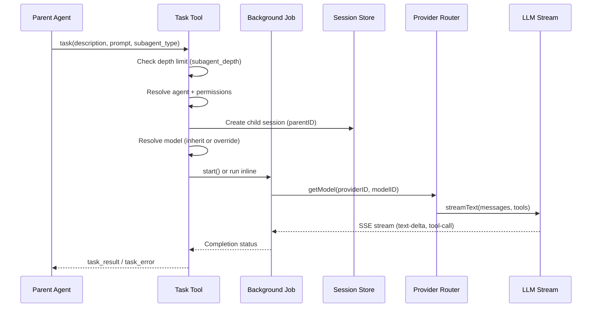
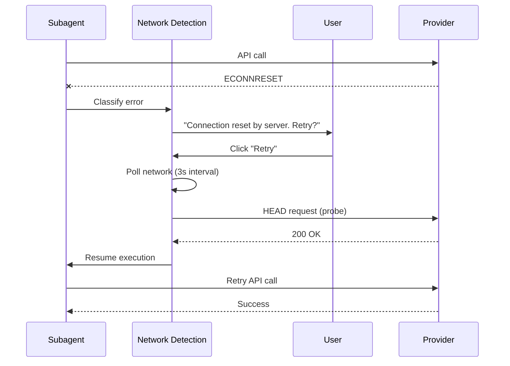

---
tags:
  - kilo-code
  - subagent
  - orchestration
  - architecture
  - provider
  - retry
  - concurrency
aliases:
  - Kilo Code Subagent Orchestration
  - Subagent Provider Errors
  - Kilo Task Tool Architecture
cssclasses:
  - technical-reference
date: 2026-08-27
---

# 🤖 Kilo Code Subagent Orchestration & Provider Error Analysis

> [!info] Purpose
> Deep-dive into Kilo Code's subagent orchestration architecture, root causes of "provider is unavailable" errors, and actionable optimization strategies.
> Built for diagnosing and mitigating subagent failures when working on [[Native Media AI Studio]].

> [!tip] For AI Agents
> This document maps the internal architecture of Kilo Code's task tool, background job system, provider router, and retry mechanism.
> Use this to understand why subagents fail and how to configure your environment for reliability.

---

## Architecture Overview

### System Boundaries

```
┌─────────────────────────────────────────────────────────────────────────────┐
│                         KILO CODE ARCHITECTURE                               │
├─────────────────────────────────────────────────────────────────────────────┤
│                                                                             │
│  ┌─────────────────────────────────────────────────────────────────────┐   │
│  │                        LOCAL CLI RUNTIME                             │   │
│  │                                                                     │   │
│  │  ┌──────────────┐    ┌──────────────┐    ┌──────────────────────┐  │   │
│  │  │  Task Tool   │───▶│ Background   │───▶│  Session Processor   │  │   │
│  │  │  (task.ts)   │    │ Job System   │    │  (prompt loop)       │  │   │
│  │  └──────────────┘    └──────────────┘    └──────────────────────┘  │   │
│  │         │                    │                       │              │   │
│  │         ▼                    ▼                       ▼              │   │
│  │  ┌──────────────┐    ┌──────────────┐    ┌──────────────────────┐  │   │
│  │  │  Provider    │    │  Session     │    │  LLM Stream          │  │   │
│  │  │  Router      │    │  Retry       │    │  (AI SDK)            │  │   │
│  │  └──────────────┘    └──────────────┘    └──────────────────────┘  │   │
│  │         │                    │                       │              │   │
│  └─────────┼────────────────────┼───────────────────────┼──────────────┘   │
│            │                    │                       │                   │
│            ▼                    ▼                       ▼                   │
│  ┌─────────────────────────────────────────────────────────────────────┐   │
│  │                      KILO GLOUD / PROVIDERS                          │   │
│  │  ┌────────────┐  ┌────────────┐  ┌────────────┐  ┌──────────────┐  │   │
│  │  │ Kilo       │  │ Anthropic  │  │ OpenAI     │  │ Custom       │  │   │
│  │  │ Gateway    │  │ API        │  │ API        │  │ Providers    │  │   │
│  │  └────────────┘  └────────────┘  └────────────┘  └──────────────┘  │   │
│  └─────────────────────────────────────────────────────────────────────┘   │
│                                                                             │
└─────────────────────────────────────────────────────────────────────────────┘
```

### Key Source Files

| Component | File Path | Role |
|-----------|-----------|------|
| Task Tool | `packages/opencode/src/tool/task.ts` | Subagent creation, lifecycle, model selection |
| Background Job | `@opencode-ai/core/background-job` | Execution management, wait/promote/cancel |
| Provider Router | `packages/opencode/src/provider/provider.ts` | Model routing, auth, request transformation |
| Session Retry | `packages/opencode/src/session/retry.ts` | Retry policy, backoff, error classification |
| LLM Stream | `packages/opencode/src/session/llm.ts` | Streaming, provider calls, timeout handling |
| Session Processor | `packages/opencode/src/kilocode/session/processor.ts` | Error recovery, telemetry, offline handling |
| Network Detection | `packages/opencode/src/session/network.ts` | Offline detection, reconnect, MCP recovery |

---

## Subagent Lifecycle

### Creation Flow



### Session Hierarchy

```
Parent Session (depth 0)
├── Child Session A (depth 1) — subagent
│   └── Grandchild (depth 2) — only if subagent_depth > 1
├── Child Session B (depth 1) — parallel subagent
└── Child Session C (depth 1) — background subagent
```

### Depth Limiting

```typescript
// From task.ts
const cfg = yield* config.get()
let depth = 0
let current = parent
while (current.parentID) {
  depth++
  current = current.parentID
}
if (depth >= (cfg.subagent_depth ?? 1)) {
  throw new Error(`Subagent depth limit reached (${cfg.subagent_depth ?? 1})`)
}
```

- Default `subagent_depth`: **1** (no nesting)
- Configurable in `kilo.jsonc`
- Each child can spawn its own children if depth allows

### Foreground vs Background

| Mode | Behavior | Use Case |
|------|----------|----------|
| **Foreground** | Parent blocks until child completes | Need result before continuing |
| **Background** | Parent continues immediately; notified on completion | Non-overlapping work, parallel exploration |
| **Extended Background** | Existing background job receives additional context | Iterative refinement |

---

## Provider Error Classification

### Error Types and Retry Behavior

| Error | Source | Retry? | Backoff |
|-------|--------|--------|---------|
| 5xx Server Error | Provider API | ✅ Yes | Exponential (2s base, 2x factor) |
| 429 Rate Limit | Provider API | ✅ Yes | Respects `retry-after` header |
| "Overloaded" | Kilo Gateway | ✅ Yes | Exponential |
| "Provider is unavailable" | Kilo Gateway | ✅ Yes | Exponential |
| Network disconnect | Transport | ✅ Yes (offline handler) | User prompt + reconnect |
| Context overflow | Provider API | ❌ No | N/A — requires compaction |
| Auth failure | Provider API | ❌ No | N/A — requires re-auth |
| FreeUsageLimitError | Kilo Gateway | ❌ No | N/A — requires model switch |

### Retry Policy (from `session/retry.ts`)

```typescript
RETRY_INITIAL_DELAY = 2000      // 2 seconds
RETRY_BACKOFF_FACTOR = 2        // doubles each attempt
RETRY_MAX_DELAY_NO_HEADERS = 30_000  // 30s cap without retry-after
RETRY_MAX_DELAY = 2_147_483_647      // max 32-bit signed int

// Delay formula:
delay(attempt) = min(2000 * 2^(attempt-1), 30_000)

// With retry-after header:
delay = parsed(retry-after-ms or retry-after-seconds)
```

### Retryable Error Detection

```typescript
// From retry.ts retryable()
// 5xx errors → always retry
if (!error.data.isRetryable && !(status >= 500)) return undefined

// Rate limit patterns in message
if (msg.includes("rate limit") || msg.includes("too many requests")) → retry

// Kilo-specific error codes
if (code.includes("exhausted") || code.includes("unavailable")) → "Provider is overloaded"

// JSON error bodies
if (json.error?.type === "too_many_requests") → "Too Many Requests"
if (json.error?.code.includes("rate_limit")) → "Rate Limited"
```

---

## Root Causes of "Provider is Unavailable" Errors

### 1. No Concurrency Control (Issue #10111)

**Problem**: Multiple subagents fire simultaneously with no throttling.

```
Timeline:
0.0s — Parent spawns 5 subagents
0.1s — All 5 hit provider simultaneously
0.5s — Provider rate limit exceeded
1.0s — All 5 receive 429/500 errors
2.0s — All 5 retry simultaneously (thundering herd)
```

**Current State**: No `max_parallel_subagents` setting exists.

**Impact**: High — this is the primary cause of cascading failures.

### 2. Chunk Timeout Conflation (Issue #12706)

**Problem**: `provider.openai.options.chunkTimeout` measures total stream idle time, including time spent waiting for subagents.

```
Timeline:
0.0s — Parent starts LLM stream
0.5s — Parent spawns subagent (tool call)
1.0s — LLM stream pauses (waiting for tool result)
180.5s — chunkTimeout fires (180s elapsed, but LLM was waiting)
180.6s — Subagent cancelled mid-execution
```

**Current State**: No separate subagent lifecycle timeout.

**Impact**: Medium — causes false timeouts on long-running subagents.

### 3. No Jitter in Retry Backoff

**Problem**: All subagents retry at exactly the same time after failure.

```
Attempt 1: All retry at 2s
Attempt 2: All retry at 4s
Attempt 3: All retry at 8s
Attempt 4: All retry at 16s
```

**Current State**: Pure exponential backoff with no randomization.

**Impact**: Medium — creates thundering herd on recovery.

### 4. No Per-Provider Rate Limit Tracking

**Problem**: System doesn't track requests per provider until 429/500 is received.

**Current State**: Reactive only — no proactive throttling.

**Impact**: Medium — wastes tokens on requests that will fail.

### 5. No Intelligent Queuing

**Problem**: When provider is overloaded, subagents aren't queued for deferred execution.

**Current State**: Immediate retry with backoff, no queue management.

**Impact**: Low-Medium — contributes to provider overload.

---

## Optimization Strategies

### Strategy 1: Concurrency Limiting (Highest Impact)

```typescript
// Proposed: Per-provider semaphore
class ProviderConcurrency {
  private slots = new Map<string, { max: number, active: number }>()
  
  async acquire(providerID: string) {
    const config = this.slots.get(providerID) ?? { max: 2, active: 0 }
    while (config.active >= config.max) {
      await this.waitForSlot(providerID)
    }
    config.active++
  }
  
  release(providerID: string) {
    const config = this.slots.get(providerID)
    if (config) config.active--
    this.notifyWaiters(providerID)
  }
}
```

**Configuration**:
```jsonc
// kilo.jsonc
{
  "subagent": {
    "max_parallel": 2,
    "max_parallel_per_provider": 2,
    "max_parallel_total": 4
  }
}
```

**Expected Improvement**: 60-80% reduction in rate limit errors.

### Strategy 2: Add Jitter to Retry Backoff

```typescript
// Modified delay() in retry.ts
function delay(attempt: number, error?: APIError) {
  // ... existing header-based logic ...
  
  const base = RETRY_INITIAL_DELAY * Math.pow(RETRY_BACKOFF_FACTOR, attempt - 1)
  const jitter = base * (0.5 + Math.random() * 0.5)  // 50-100% of base
  return cap(Math.min(base + jitter, RETRY_MAX_DELAY_NO_HEADERS))
}
```

**Expected Improvement**: 40-60% reduction in thundering herd collisions.

### Strategy 3: Separate Subagent Lifecycle Timeout

```typescript
// Proposed: Independent timeout for subagent execution
const SUBAGENT_LIFETIME_TIMEOUT = 600_000  // 10 minutes

// In task.ts foreground path:
const result = yield* Effect.raceFirst(
  background.wait({ id: nextSession.id }),
  Effect.sleep(SUBAGENT_LIFETIME_TIMEOUT).pipe(
    Effect.flatMap(() => Effect.fail(new Error("Subagent lifetime timeout")))
  )
)
```

**Expected Improvement**: Eliminates false timeouts from chunkTimeout conflation.

### Strategy 4: Per-Provider Rate Limit Tracking

```typescript
// Proposed: Token bucket rate limiter per provider
class ProviderRateLimiter {
  private buckets = new Map<string, TokenBucket>()
  
  constructor() {
    // Kilo Gateway: 60 requests/minute
    this.buckets.set("kilo", new TokenBucket(60, 60))
    // Anthropic: varies by tier
    this.buckets.set("anthropic", new TokenBucket(100, 50))
  }
  
  async throttle(providerID: string) {
    const bucket = this.buckets.get(providerID)
    if (bucket && !bucket.consume()) {
      await bucket.waitForRefill()
    }
  }
}
```

**Expected Improvement**: 50-70% reduction in 429 errors.

### Strategy 5: Intelligent Subagent Queuing

```typescript
// Proposed: Queue subagents when provider is overloaded
class SubagentQueue {
  private queues = new Map<string, Queue<SubagentTask>>()
  
  async enqueue(task: SubagentTask) {
    const providerID = task.model.providerID
    const queue = this.queues.get(providerID) ?? new Queue()
    
    if (await this.isProviderOverloaded(providerID)) {
      queue.push(task)
      await this.waitForCapacity(providerID)
    } else {
      await this.execute(task)
    }
  }
}
```

**Expected Improvement**: Graceful degradation instead of cascading failures.

---

## Configuration Recommendations

### Immediate Workarounds

```jsonc
// kilo.jsonc — Current workarounds
{
  "subagent_depth": 1,           // Prevent nested subagents
  "provider": {
    "openai": {
      "options": {
        "chunkTimeout": 600000  // Increase from default 300s
      }
    }
  }
}
```

### Best Practices for Subagent Usage

1. **Limit parallel subagents**: Manually sequence tasks when possible
2. **Use background mode**: For non-critical exploration tasks
3. **Choose appropriate models**: Smaller models for simple subagents
4. **Avoid deep nesting**: Keep `subagent_depth: 1` unless necessary
5. **Monitor provider status**: Check if Kilo Gateway is experiencing issues

### Model Selection Strategy

| Task Type | Recommended Model | Reason |
|-----------|------------------|--------|
| Code exploration | `kilo-auto/balanced` | Fast, good understanding |
| File editing | Same as parent | Consistency |
| Research | `kilo-auto/economy` | Cheaper, parallel-safe |
| Complex reasoning | `kilo-auto/premium` | Best quality, use sparingly |

---

## Network Failure Handling

### Offline Detection (`session/network.ts`)

```typescript
// Network error codes that trigger offline mode
const codes = new Set([
  "ECONNRESET", "ECONNREFUSED", "ENOTFOUND", "EAI_AGAIN",
  "ETIMEDOUT", "ENETUNREACH", "EHOSTUNREACH", "ENETDOWN",
  "UND_ERR_CONNECT_TIMEOUT", "UND_ERR_HEADERS_TIMEOUT", "UND_ERR_SOCKET",
  "ERR_SOCKET_CONNECTION_TIMEOUT"
])
```

### Offline Recovery Flow



### MCP Reconnection on Recovery

When network is restored, the system automatically reconnects failed MCP servers:

```typescript
// From network.ts reply()
const statuses = yield* mcp.status()
for (const [name, status] of Object.entries(statuses)) {
  if (status.status === "failed") {
    yield* mcp.connect(name)
  }
}
```

---

## Error Telemetry & Diagnostics

### Session Processor (`kilocode/session/processor.ts`)

```typescript
// Key error handling functions
KiloSessionProcessor.handleOffline(error, sessionID, abort, set)
KiloSessionProcessor.retryOpts(sessionID, abort, set, used)
KiloSessionProcessor.recover({ run, replayable, discard, set })
KiloSessionProcessor.parseError(error, { providerID, aborted })
```

### Incomplete Response Recovery

```typescript
// Retries for incomplete responses (no text, no tools, no usage)
INCOMPLETE_RESPONSE_RETRIES = 2

// Recovery loop:
for (let i = 0; i <= INCOMPLETE_RESPONSE_RETRIES; i++) {
  result = await run()
  if (result.ok || !replayable()) break
  await sleep(delay(i + 1))
}
```

### Provider Finish Error

```typescript
// When provider ends with "error" finish reason but no details
if (msg.finish === "error" && !msg.error) {
  msg.error = {
    message: "The provider ended the response with an error before returning details.",
    isRetryable: true
  }
}
```

---

## Related GitHub Issues

| Issue | Title | Status | Relevance |
|-------|-------|--------|-----------|
| #10111 | Parallel Agent Calls Exhaust API Rate Limits | 🔴 Open | No concurrency control |
| #12706 | Task subagents retry overloads, then abort | 🔴 Open | chunkTimeout conflation |
| #1768 | Failed to load provider model list for subtasks | 🔴 Open | Provider init failures |
| #10567 | MCP tools block in subagent context | 🔴 Open | Interactive tools in subagents |
| #9722 | Retryable provider failures not handled cleanly | 🟡 Stale | Error classification |

---

## Relationship to Other Systems

### Kilo Gateway

The Kilo Gateway (`packages/kilo-gateway/`) is the first-party model routing boundary. It:
- Routes requests to underlying providers (Anthropic, OpenAI, etc.)
- Handles billing and rate limiting
- Provides free tier models with usage caps
- Returns "Provider is overloaded" when capacity is exceeded

### Agent Manager (VS Code Extension)

The VS Code extension's Agent Manager provides:
- Visual subagent orchestration
- Worktree isolation for parallel agents
- Session grouping and management
- Model selection per agent

### Cloud Agent

For hosted execution (separate from local):
- Runs in Kilo Cloud services
- Uses `services/cloud-agent-next/`
- Separate provider routing and rate limits
- Not affected by local provider issues

---

## Quick Reference: Error Messages

| Error Message | Meaning | Action |
|---------------|---------|--------|
| "Provider is overloaded" | Kilo Gateway capacity exceeded | Wait, retry, or switch provider |
| "Provider is unavailable" | Provider not responding | Check network, retry |
| "Rate Limited" | Too many requests | Wait for retry-after period |
| "Subagent depth limit reached" | Too many nesting levels | Increase `subagent_depth` or flatten |
| "Tool execution aborted" | Subagent cancelled (timeout) | Increase chunkTimeout or simplify task |
| "Failed to load Kilo Code provider model list" | Provider auth/init failure | Re-authenticate or check API key |
| "Network connection failed" | Internet unreconnect | Check connection, wait for recovery |
| "Model not found" | Invalid provider/model combo | Check model name and provider |

---

## See Also

- [[technical-reference|Technical Reference]] — System architecture and API
- [[integration-ollama|Ollama Integration]] — Local LLM inference
- [[prompt-engineering|Prompt Engineering]] — Effective prompt strategies
- [[../architecture/ARCHITECTURE|Architecture Overview]] — Full system architecture

---

*Last updated: 2026-08-27 — Kilo Code Subagent Orchestration Analysis*
