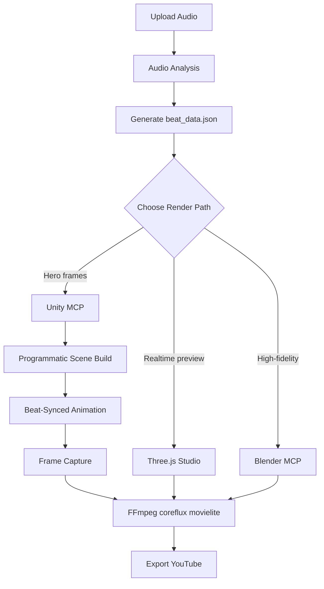

---
tags:
  - unity
  - 3d-rendering
  - mcp
  - scene-building
  - audio-reactive
  - frame-capture
aliases:
  - Unity MCP Integration
  - Unity Integration
  - Unity Scene Builder
cssclasses:
  - technical-guide
date: 2026-09-24
---

# 🎮 Unity MCP Integration

> [!info] Scope
> Controlling Unity 6 via MCP bridge for deterministic frame capture, audio-reactive
> visualization, and programmatic scene building.
> Part of [[Native Media AI Studio]] music video pipeline.

> [!tip] Protected Directory
> `unity-visualizer/` is **never deleted** during cleanup (per AGENTS.md).
> It is the standalone audio-reactive visualization project using URP 17.0.0.
>
> [!info] Canonical contract reference
> Exact Unity MCP input/output schemas live in [[mcp-contracts-2026#2-unity-mcp-bridge]].
> This document owns the broader Unity workflow, render-path decision, hardware
> fit, and operational guidance; it should not duplicate tool schemas.

---

## Current Unity Footprint

| Project | Purpose | Unity Version | Render Path |
|---------|---------|---------------|-------------|
| `unity-project-mcp/` | Headless scene generation + frame capture for music videos | 6000.x (Unity 6) | Built-in Pipeline |
| `unity-visualizer/` | Standalone audio-reactive visualization (URP 17.0.0) | 6000.6.0f1 | URP |

### Key Scripts

- `AutoCapture.cs` — Frame-accurate screenshot capture at fixed FPS
- `BeatPulse.cs` — Beat-synced scale pulsing for props/stage elements
- `CoronationScene.cs` — Full programmatic scene build + render pipeline example

### MCP Bridge

- Bridge: `tools/mcp/unity-mcp-bridge.mjs`
- Protocol: MCP stdio → HTTP → Unity Pipeline server (WebSocket)
- Port: resolved dynamically from `unity-project-mcp/Library/Pipeline/.unity-pipeline-port`
- Tools exposed: 100+ Unity Editor commands + music-video-specific helpers (`get_beat_data`, `create_beat_animation`, `capture_frame_sequence`)

---

## Why Unity Wins These Jobs

### 1. Deterministic Frame Capture

Unity's `ScreenCapture.CaptureScreenshot()` + Play Mode gives frame-accurate, artifact-free sequences without fighting Blender's background-mode constraints.

```csharp
// AutoCapture.cs pattern
public int fps = 24;
public string outputPath = "Assets/Textures/auto_frame";

void Update() {
    timer += Time.deltaTime;
    if (timer >= interval) {
        timer = 0f;
        frameCount++;
        string path = outputPath + "_" + frameCount.ToString("D4") + ".png";
        ScreenCapture.CaptureScreenshot(path);
    }
}
```

### 2. Real-Time Audio Reactivity

`AudioSource` + `ParticleSystem` + animation curves run at 60fps in Edit/Play mode. No external render farm, no sample-batch overhead.

```csharp
// BeatPulse.cs pattern
public float beatInterval = 0.394f; // 152 BPM
public float pulseScale = 1.3f;

void Update() {
    timer += Time.deltaTime;
    if (timer >= beatInterval) {
        timer = 0f;
        targetScale = pulseScale;
    }
    currentScale = Mathf.Lerp(currentScale, targetScale, Time.deltaTime * decaySpeed);
    transform.localScale = Vector3.one * currentScale;
}
```

### 3. MCP Bridge + Agent Control

The `unity-mcp-bridge.mjs` exposes 100+ Unity commands through MCP. Agents can:
- Build scenes from natural language (`plan_unity_scene`)
- Read beat data and generate keyframed animations (`create_beat_animation`)
- Capture frame sequences programmatically
- Toggle object visibility, play/blend animations, query editor status

### 4. Artist Tooling Ecosystem

- Built-in particle systems, timeline, animation window
- Shader Graph for custom audio-reactive materials
- Cinemachine for camera choreography
- No external renderer version chase (unlike Blender 4.x → 5.x API churn)

### 5. GTX 1070 Ti Fit

| Task | VRAM | Notes |
|------|------|-------|
| URP real-time viewport | ~1 GB | 1080p viewport |
| Frame capture (no scene complexity) | ~1-2 GB | No ray tracing |
| Particle systems (50-100 embers) | ~500 MB | Simulated on CPU |
| Audio analysis (Ollama/heavy models) | N/A | Offloaded to backend |

Unity's SRP + URP keeps the GPU light compared to Cycles/Blender GPU rendering.

---

## Unity vs Blender vs Three.js Decision Matrix

> See Q1 in [[decision-log|Architecture Decision Log]] for the full convergence question.

| Criterion | Unity | Blender | Three.js Studio |
|-----------|-------|---------|-----------------|
| **Deterministic frame capture** | ✅ Best (Play Mode + ScreenCapture) | ✅ Good (background mode) | ❌ No (browser screenshot limits) |
| **Real-time audio reactivity** | ✅ Best (AudioSource + Particles) | ⚠️ Manual (driver/keyframe) | ✅ Good (Web Audio API) |
| **Artist tooling depth** | ✅ Best (Cinemachine, Shader Graph) | ✅ Best (full DCC) | ❌ Limited |
| **Agent MCP control** | ✅ 100+ commands via bridge | ✅ Blender MCP 1.5 | ✅ Direct DOM/API |
| **Version stability** | ⚠️ Unity 6 LTS is stable | ⚠️ 5.x → 6.x API drift | ✅ No external editor |
| **Maintenance cost** | ⚠️ Medium (Unity Hub, editor) | ❌ High (addon version chase) | ✅ Lowest |
| **Deployability** | ⚠️ Needs Unity Editor + license | ⚠️ Needs Blender + addon | ✅ Runs in browser |
| **Hero render quality** | ✅ Good (HDRP/URP path tracer) | ✅ Best (Cycles) | ❌ WebGL/WebGPU limits |

### Recommendation

- **Three.js Studio** — default for real-time viz, previews, user-facing visualizer (cheapest to maintain)
- **Unity** — hero frame capture, audio-reactive pre viz, beat-synced sequences where deterministic output matters
- **Blender** — high-fidelity hero renders, complex lighting, production finals

Do **not** converge to one. Each earns its place.

---

## Pipeline Architecture



### Data Flow

1. **[[music-video-production]]** → Audio analysis → `beat_data.json` (tempo, beat_times, keyframes)
2. **[[technical-reference]]** → Agent reads beat data, picks render path
3. **Unity MCP** → Build scene, animate, capture frames
4. **[[comfyui-workflows]]** → Generate textures/assets as needed
5. **[[blender-mcp]]** → High-fidelity finals (optional)
6. **coreflux/movielite/FFmpeg** → Composite + encode

---

## Technical Advantages for GTX 1070 Ti

### VRAM Budget

```
┌─────────────────────────────────────────────────────────┐
│ 8GB VRAM Budget                                         │
├─────────────────────────────────────────────────────────┤
│ OS + Desktop Compositor  │ ████████░░░░░░░░░░░░  ~1.5GB │
│ Available for Rendering  │ ██████████████░░░░░░  ~6.5GB │
│ Safety Margin            │ ██░░░░░░░░░░░░░░░░░░  ~1.0GB  │
│ Usable Peak              │ ████████████░░░░░░░░  ~5.5GB  │
└─────────────────────────────────────────────────────────┘
```

Unity URP fits comfortably within this envelope:

- 1080p URP viewport: ~1 GB
- 4x MSAA: +512 MB
- Particle systems: CPU-simulated, no VRAM cost
- No ray tracing, no path tracing by default

### Pascal-Specific Settings

- **No RTX features:** Avoid ray-traced shadows, path tracing, DLSS
- **Use SRP Batcher:** Batch draw calls for identical shaders
- **Limit real-time lights:** 8-16 dynamic lights max; bake the rest
- **Compress textures:** ASTC/ETC2 for imported assets

### Render Time Estimates (1080p, 24fps, 10s clip = 240 frames)

| Path | Per Frame | Total (240 frames) |
|------|-----------|-------------------|
| Unity URP (no FX) | ~0.3s | ~1.5 min |
| Unity URP + particles | ~0.5s | ~3 min |
| Blender EEVEE | ~2s | ~8 min |
| Blender Cycles | ~15s | ~60 min |

---

## Code Patterns

### Natural Language Scene Planning

```javascript
// plan_unity_scene returns structured commands from Ollama
{
  "summary": "Crown on pedestal with ember particles",
  "commands": [
    {"command": "create_gameobject", "parameters": {"name": "Pedestal", "primitive": "cylinder"}},
    {"command": "add_component", "parameters": {"target": "Pedestal", "type": "ParticleSystem"}},
    {"command": "set_object_visibility", "parameters": {"object_name": "Crown", "visible": true}}
  ]
}
```

### Beat-Synced Animation from Data

```javascript
// get_beat_data + create_beat_animation
{
  "tempo": 152,
  "beat_times": [0.0, 0.394, 0.788, ...],
  "keyframes": [0, 9, 19, 28, ...] // 24fps frame indices
}

// create_beat_animation produces:
{
  "instructions": "Apply beat-scaled keyframes to 'Crown'",
  "keyframe_count": 24,
  "keyframes": [0, 9, 19, ...],
  "params": {"pulse_scale": 1.5, "frame_rate": 24}
}
```

### Full Scene Build Script (CoronationScene.cs)

```csharp
IEnumerator RenderFrames() {
    while (frameCount < fps * durationSeconds) {
        yield return wait;
        beatTimer += interval;
        if (beatTimer >= beatInterval) {
            beatTimer = 0f;
            StartCoroutine(PulseCrown());
        }
        frameCount++;
        string path = outputPath + frameCount.ToString("D4") + ".png";
        ScreenCapture.CaptureScreenshot(path);
    }
    Debug.Log($"Render complete: {frameCount} frames");
    #if UNITY_EDITOR
    UnityEditor.EditorApplication.ExitPlaymode();
    #endif
}
```

---

## What Unity Does NOT Replace

- **Blender** — complex hero renders, Cycles path tracing, sculpting, rigging
- **Three.js Studio** — user-facing real-time viz, zero-install web preview
- **ComfyUI** — AI image/video generation (Wan, Hunyuan3D, etc.)
- **Remotion** — programmatic React-based compositing + final export
- **FFmpeg/coreflux/movielite** — final encoding and filter graphs

Unity is a **render + pre-vis node** in the pipeline, not a replacement for the full stack.

---

## Integration with Pipeline

### Entry Points

| Agent Action | Unity Tool | Output |
|-------------|------------|--------|
| "Build a stage with beat-synced spotlight" | `plan_unity_scene` → `unity_command` | Scene in Editor |
| "Render 10 seconds at 24fps" | `capture_frame_sequence` + `AutoCapture.cs` | PNG sequence |
| "Animate crown to beat" | `create_beat_animation` | AnimationClip asset |
| "Capture hero frame" | `capture_scene_view` | PNG file |
| "Check if Unity is compiling" | `editor_status` | Status JSON |

### Asset Handoff

```
ComfyUI → GLB/FBX → Unity Import → Material (Standard/URP) → Render → PNG Sequence → FFmpeg → MP4
```

### Beat Data Contract

- Generated by: `tools/analyze_and_sync.py`
- Consumed by: `unity-mcp-bridge.mjs` (`get_beat_data`)
- Format: `{ tempo, beat_times, keyframes, duration_seconds }`
- Frame mapping: `frame = int(beat_time * fps)`

---

## Setup & Operation

### Starting Unity for Headless Rendering

```powershell
# From scripts/ or tools/
scripts\start-unity-headless.ps1
# Unity opens in -batchmode with GPU rendering
# Pipeline server writes port to Library/Pipeline/.unity-pipeline-port
```

### MCP Bridge Connection

```powershell
# Bridge reads port file automatically
node tools/mcp/unity-mcp-bridge.mjs
# Exposes stdio MCP server
```

### Verification

```powershell
# List all available Unity commands
node -e "const bridge = require('./tools/mcp/unity-mcp-bridge.mjs'); bridge.list_pipeline_commands()"
```

---

## Troubleshooting

### Unity Not Responding

| Error | Cause | Solution |
|-------|-------|----------|
| `Unity API error: 404` | Pipeline server not started | Start Unity headless or open project in Editor |
| `no port file` | Unity hasn't initialized Pipeline | Wait for `Library/Pipeline/` to appear |
| `Command not found` | Agent invented invalid command | Use `list_pipeline_commands` to verify |

### Render Artifacts

| Issue | Cause | Fix |
|-------|-------|-----|
| Black frames | Camera inside geometry | Move camera back, check `near` clip plane |
| Blurry output | Resolution mismatch | Set `Screen.SetResolution` before capture |
| Missing particles | Simulating in Edit mode | Start Play mode; particles need simulation |

---

## See Also

- [[music-video-production]] — Full production workflow
- [[3d-rendering]] — GPU rendering optimization
- [[blender-mcp]] — Blender MCP integration
- [[comfyui-workflows]] — ComfyUI for image/video generation
- [[three-js-studio]] — Browser studio implementation
- [[technical-reference]] — System architecture
- [[decision-log]] — Q1: Unity vs Blender vs Three.js convergence
- [[prompt-engineering]] — 3D asset prompts

---

*Last updated: 2026-09-24*
